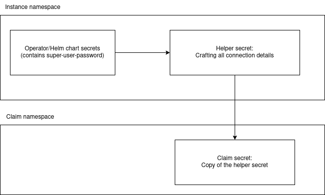

= Manage secrets not coming from a provider

An operator or a helm chart can't create a crossplane connection secret. Therefore we need to create one.

To be able to manage the connection secrets via crossplane, we create a helper secret object via provider-kubernetes.
The helper secret object is populated via composition and is made aware to crossplane via `writeConnectionSecretToRef`.
Doing this  we simulate the behaviour of connection secrets from a crossplane provider.

Once we've got a crossplane managed secret, we can use `writeConnectionSecretToRef` in the claim to reference the final secret (which is automatically created by crossplane)

Visualizing this process it looks like the following:

== Example

Let's assume we've got an operator or a helm chart that creates a secret called `<composite_name>` in the namespace `vshn-<composite_name>` that contains a password in the key `superuser-password`.

We will then create a secret object in our composition like shown in the snippet below.

This will result in a regular temporary secret (our helper secret) which will also be placed in the `vshn-<composite_name>` namespace. The key `MY_PASSWORD` is patched in from the secret created by the operator or helm chart. (1)

The name and namespace of that secret is also patched in accordingly. (2)

By using the `writeConnectionSecretToRef` key, we make crossplane aware of the connection secret. (3)

We again patch the name and namespace of that helper secret object accordingly. (4)

Finally we list the propagation secret keys from that object to the composition instance connection secret. (5)

[source,yaml]
----
- base:
    apiVersion: kubernetes.crossplane.io/v1alpha1
    kind: Object
    metadata: {}
    spec:
      forProvider:
        manifest:
          apiVersion: v1
          kind: Secret
          metadata: {}
          stringData:
            MY_APP_PORT: 1234
      providerConfigRef:
        name: kubernetes
      references:
      - patchesFrom:                            # (1)
          apiVersion: v1                        # (1)
          fieldPath: data.superuser-password    # (1)
          kind: Secret                          # (1)
          name: ""                              # (1)
          namespace: ""                         # (1)
        toFieldPath: data.MY_PASSWORD           # (1)
      writeConnectionSecretToRef:   # (3)
        name: ""                    # (3)
        namespace: ""               # (3)
  connectionDetails:
  - fromConnectionSecretKey: MY_APP_PORT     # (5)
    name: MY_APP_PORT                        # (5)
    type: FromConnectionSecretKey            # (5)
  - fromConnectionSecretKey: MY_PASSWORD     # (5)
    name: MY_PASSWORD                        # (5)
    type: FromConnectionSecretKey            # (5)
  patches:
  - patchSetName: annotations
    type: PatchSet
  - patchSetName: labels
    type: PatchSet
  - fromFieldPath: metadata.labels[crossplane.io/composite]     # (4)
    toFieldPath: metadata.name                                  # (4)
    transforms:                                                 # (4)
    - string:                                                   # (4)
        fmt: '%s-connection'                                    # (4)
        type: Format                                            # (4)
      type: string                                              # (4)
    type: FromCompositeFieldPath                                # (4)
  - fromFieldPath: metadata.labels[crossplane.io/composite]     # (4)
    toFieldPath: spec.forProvider.manifest.metadata.namespace   # (4)
    transforms:                                                 # (4)
    - string:                                                   # (4)
        fmt: vshn-%s                                            # (4)
        type: Format                                            # (4)
      type: string                                              # (4)
    type: FromCompositeFieldPath                                # (4)
  - fromFieldPath: metadata.labels[crossplane.io/claim-name]    # (4)
    toFieldPath: spec.forProvider.manifest.metadata.name        # (4)
    transforms:                                                 # (4)
    - string:                                                   # (4)
        fmt: '%s-connection'                                    # (4)
        type: Format                                            # (4)
      type: string                                              # (4)
    type: FromCompositeFieldPath                                # (4)
  - fromFieldPath: metadata.labels[crossplane.io/composite]   # (2)
    toFieldPath: spec.references[0].patchesFrom.namespace     # (2)
    transforms:                                               # (2)
    - string:                                                 # (2)
        fmt: vshn-%s                                          # (2)
        type: Format                                          # (2)
      type: string                                            # (2)
    type: FromCompositeFieldPath                              # (2)
  - fromFieldPath: metadata.labels[crossplane.io/composite]   # (2)
    toFieldPath: spec.references[0].patchesFrom.name          # (2)
    type: FromCompositeFieldPath                              # (2)

  - fromFieldPath: metadata.labels[crossplane.io/composite]   # (4)
    toFieldPath: spec.writeConnectionSecretToRef.namespace    # (4)
    transforms:                                               # (4)
    - string:                                                 # (4)
        fmt: vshn-%s                                          # (4)
        type: Format                                          # (4)
      type: string                                            # (4)
    type: FromCompositeFieldPath                              # (4)
  - fromFieldPath: metadata.labels[crossplane.io/claim-name]  # (4)
    toFieldPath: spec.writeConnectionSecretToRef.name         # (4)
    transforms:                                               # (4)
    - string:                                                 # (4)
        fmt: '%s-connection'                                  # (4)
        type: Format                                          # (4)
      type: string                                            # (4)
    type: FromCompositeFieldPath                              # (4)

----

Assuming we've got a claim called `my-great-app` with the following content:

[source,yaml]
---
[...]
metadata:
  name: my-app
  namespace: my-app-namespace
spec:
  writeConnectionSecretToRef:
    name: my_connection_secret
---

The operator or helm chart will thus create a secret like this:

[source,yaml]
---
apiVersion: v1
kind: Secret
type: Opaque
metadata:
  name: my-app-c48ad
  namespace: vshn-my-app-c48ad
data:
  MY_PASSWORD: Rm9vYmFy
---

The composition will create the helper secret like this:
[source,yaml]
---
apiVersion: v1
kind: Secret
type: connection.crossplane.io/v1alpha1
metadata:
  name: my-app-c48ad-connection
  namespace: vshn-my-app-c48ad
  ownerReferences:
  - apiVersion: kubernetes.crossplane.io/v1alpha1
    controller: yes
    kind: Object
    name: my-app-c48ad-connection
    uid: f22e3083-6a89-4286-ba6d-f990ee91ccad
data:
  MY_PASSWORD: Rm9vYmFy
  MY_APP_PORT: 1234
---

Finally the claim secret will be populated like the following:
[source,yaml]
---
apiVersion: v1
kind: Secret
type: connection.crossplane.io/v1alpha1
metadata:
  name: my_connection_secret
  namespace: my-app-namespace
data:
   MY_PASSWORD: Rm9vYmFy
    MY_APP_PORT: 1234
---
